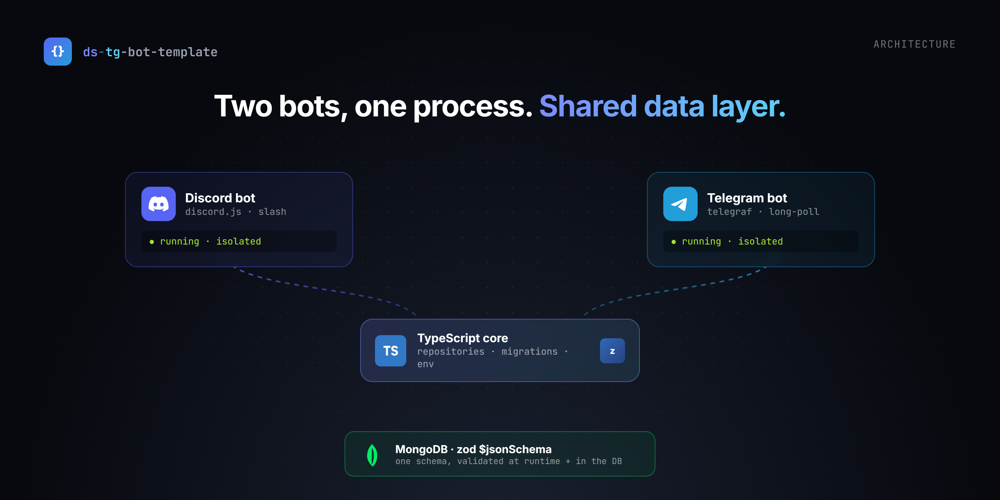

# ds-tg-bot-template

Discord **and** Telegram bots in one TypeScript codebase, backed by MongoDB. One process,
both platforms, a shared data layer that zod validates (types, runtime checks, and a
generated MongoDB validator), with tracked migrations. Each bot runs isolated, so one
crashing doesn't take the other down.


**Stack:** Node 22, TypeScript (ESM, strict), discord.js, Telegraf, MongoDB (raw driver),
Zod, Pino, Docker.

The core is small on purpose: both bots start, connect to Mongo, run migrations, and
answer a `/ping`. Anything opinionated (role panels, broadcasts, admin menus, cron jobs,
multi-bot) lives in [`examples/`](examples) as copy-in code.

## Get your tokens

You need at least one (both are free):

- **Telegram:** message [@BotFather](https://t.me/BotFather), send `/newbot`, put the
  token in `TG_BOT_TOKEN`.
- **Discord:** [Developer Portal](https://discord.com/developers/applications) → New
  Application → **Bot** → put the token in `DS_BOT_TOKEN`. Invite the bot via
  **OAuth2 → URL Generator** with scopes `bot` + `applications.commands`.

## Quick start

No MongoDB installed? Use Docker, it runs the database for you.

**Docker (recommended):**

```bash
cp .env.sample .env        # add a token first
docker compose up --build
```

Builds the bot, starts MongoDB, runs migrations, launches both bots. `Ctrl+C` to stop,
`-d` to run in the background.

**Local Node (you already have MongoDB):**

```bash
npm install
cp .env.sample .env        # MONGO_URI already points at local Mongo
npm run dev
```

## Stuck?

[Open an issue](../../issues) with the log output. It's usually a bad token (the app says
so on startup) or MongoDB not running (use Docker).

## Scripts

```bash
npm run dev          # watch mode
npm run lint
npm run format:check # `npm run format` to fix
npm run typecheck    # src, tests and examples
npm test
npm run build
```

Deploying to a VPS (Docker, no PM2): [docs/DEPLOYMENT.md](docs/DEPLOYMENT.md).

## Project layout

```
src/
  index.ts              bootstrap: env -> db -> schema -> migrations -> bots
  config/env.ts         zod-validated environment
  logger/logger.ts      pino logger (stdout + rotating files)
  db/
    db.ts               connect, typed collections, syncSchema
    collection.ts       defineCollection() helper
    schema/             one zod schema + indexes per collection
    repositories/       data access built on the schema types
    migrations/runner.ts runs tracked migrations
  _migrations/          NNN_name.ts migration files
  ds-bot/               Discord: client init, slash commands
  tg-bot/               Telegram: init, admin-only middleware, commands
examples/               copy-in features
```

## The schema layer

A collection is defined once:

```ts
// src/db/schema/admins.ts
export const adminSchema = z.object({ platform: z.enum(['telegram', 'discord']), userId: z.string() /* ... */ });
export type Admin = z.infer<typeof adminSchema>;
export const adminsCollection = defineCollection({
    name: 'admins',
    schema: adminSchema,
    indexes: [{ key: { platform: 1, userId: 1 }, unique: true }],
});
```

Register it in `src/db/schema/index.ts` and add a typed accessor in `buildCollections`
(`src/db/db.ts`). On startup `syncSchema` creates the indexes and applies a MongoDB
`$jsonSchema` validator generated from the same zod schema, so the database rejects bad
documents even on writes that bypass the repositories (which validate too). Adding a
field is a one-file change.

## Migrations

Files live in `src/_migrations/` as `NNN_snake_case.ts`. Each exports an async `up`
(and optional `down`), gets the raw `Db` handle, and is recorded in the `migrations`
collection so it runs once. Use them for data changes (backfills, renames); for index
changes just edit the schema. See [examples/mongo-migrations](examples/mongo-migrations).

`001_seed_admins.ts` seeds the first Telegram admins from `SEED_TG_ADMIN_IDS` on first run.

## Why raw MongoDB (not Mongoose / Prisma)

- One source of truth: a zod schema gives the TypeScript type, runtime validation, and
  the MongoDB `$jsonSchema` validator. Mongoose adds a second schema to keep in sync,
  Prisma a third (its DSL + codegen).
- Validation lives in the database, not only in app code.
- Plain driver queries, no ORM abstraction, lightest footprint.

Want Mongoose anyway? [examples/mongoose-model](examples/mongoose-model) shows how to use
it for one collection without touching the rest.

## Environment

At least one bot token is required.

| Variable | Required | Description |
| --- | --- | --- |
| `MONGO_URI` | yes | MongoDB connection string (default `mongodb://127.0.0.1:27017`) |
| `MONGO_DB_NAME` | yes | Database name (default `ds-tg-bot-template`) |
| `DS_BOT_TOKEN` | one of | Discord bot token |
| `TG_BOT_TOKEN` | one of | Telegram bot token |
| `SEED_TG_ADMIN_IDS` | no | Comma-separated Telegram user IDs seeded as admins |
| `LOG_LEVEL` | no | `fatal\|error\|warn\|info\|debug\|trace\|silent` (default `info`) |
| `LOG_DIR` | no | Log directory (default `logs`) |

`DB_URI` / `DB_NAME` work as aliases for `MONGO_URI` / `MONGO_DB_NAME`.

## Examples

[`examples/`](examples) has copy-in features: role panel, broadcasts, moderation queue,
welcome + analytics, language roles, cooldowns, i18n, multi-bot, migrations, and more.
Each folder has a short README and notes where its files go.

## License

MIT, see [LICENSE](LICENSE).
